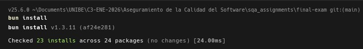
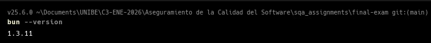
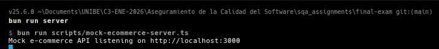
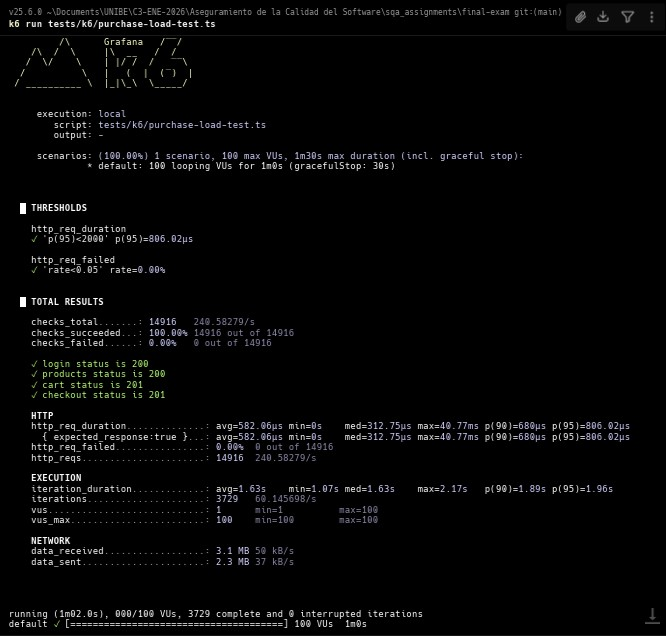
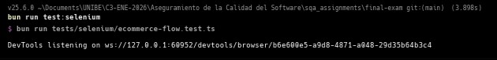
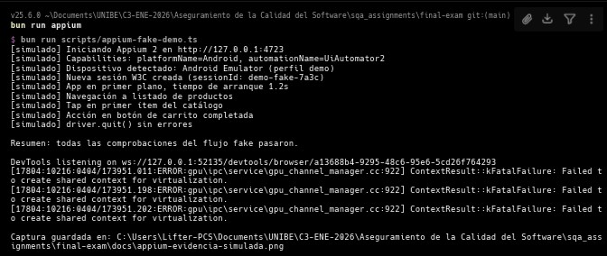

# Laboratorio de pruebas para e-commerce

**Asignatura:** Aseguramiento de la calidad del software  
**Tema:** Examen Final  
**Estudiante:** Frainer Encarnación (25-1775)

---

Proyecto académico que junta pruebas de integración (enfoque teórico), carga con k6, automatización web con Selenium y automatización móvil con Appium. El código del repositorio está en TypeScript y se ejecuta con Bun, salvo k6 que corre con el binario oficial de k6.

## Pasos para el informe y carpeta de evidencias

Ejecuta en este orden desde la raíz del proyecto (`final-exam`) y guarda las capturas en **`evidencias/`** como **`01.jpg`** a **`06.jpg`** (coinciden con las imágenes embebidas abajo).

| Orden | Qué ejecutar | Qué debes capturar | Archivo en `evidencias/` |
|------:|--------------|-------------------|---------------------------|
| 1 | `bun install` (y si quieres `bun --version` en la misma u otra captura, combina con el criterio de tu informe) | Terminal al terminar sin errores | `01.jpg` |
| 2 | `bun run server` | Terminal con el mock escuchando en el puerto 3000 | `02.jpg` |
| 3 | Con el servidor del paso 2 abierto: `k6 run tests/k6/purchase-load-test.ts` (opcional: `--duration 30s --vus 20` para una corrida corta) | Resumen final de k6 | `03.jpg` |
| 4 | `bun run test:selenium` o `$env:SELENIUM_HEADLESS="1"; bun run test:selenium` | Consola al finalizar correctamente | `04.jpg` |
| 5 | `bun run test:appium` con Appium 2, emulador Android y variables `APPIUM_*` configuradas (ver sección Appium del README) | Consola al finalizar correctamente | `05.jpg` |
| 6 | Misma corrida Appium o captura del emulador Android Studio durante la prueba | Evidencia visual del dispositivo o log extendido | `06.jpg` |

**Checklist del informe:** seis capturas del `01.jpg` al `06.jpg` cubriendo entorno, servidor mock, k6, Selenium y Appium real en Android.

## Evidencias (capturas)













## Escenarios de Pruebas de Integración

### 1. Registro y login de usuario (frontend, backend, MySQL)

**Qué se está probando:** Que un usuario nuevo pueda registrarse con datos válidos y luego iniciar sesión con las mismas credenciales, sin inconsistencias entre lo que ve en pantalla y lo que guarda el sistema.

**Sistemas involucrados:** La aplicación web o móvil (formularios y validaciones locales), la API de autenticación (hash de contraseña, emisión de token o cookie de sesión) y la base MySQL donde viven las tablas de usuarios y sesiones o refresh tokens.

**Resultado esperado:** Tras el registro, el usuario existe una sola vez en base de datos, la contraseña no viaja en claro en logs, y el login devuelve una sesión válida. Si las credenciales son incorrectas, el backend responde con error controlado y el frontend muestra un mensaje coherente, sin filtrar detalles internos.

### 2. Proceso de compra (carrito y checkout)

**Qué se está probando:** El flujo completo desde que el usuario elige productos hasta confirmar el pedido, incluyendo precios, impuestos opcionales y métodos de pago simulados o reales en entorno de prueba.

**Sistemas involucrados:** Frontend del carrito y checkout, servicios de catálogo y precios, servicio de carrito (quizá Redis o base relacional), pasarela de pago o mock de pago, y notificaciones básicas (por ejemplo email de confirmación).

**Resultado esperado:** El total mostrado coincide con la suma de líneas, no se pueden comprar cantidades negativas ni saltarse pasos obligatorios, y al confirmar se crea un pedido con estado coherente (pendiente o pagado según reglas del negocio). Si el pago falla, el pedido no queda en un estado imposible de interpretar.

### 3. Actualización de inventario después de la compra

**Qué se está probando:** Que al completarse un checkout exitoso el stock disponible baje de forma atómica y consistente, evitando sobreventa cuando varios usuarios compran el mismo SKU casi al mismo tiempo.

**Sistemas involucrados:** Servicio de pedidos, módulo de inventario o almacén, base MySQL (o motor transaccional equivalente) con restricciones de stock, y posiblemente colas o jobs que reservan unidades antes del pago.

**Resultado esperado:** Después de una compra confirmada, las unidades del producto reflejan la resta correcta. Bajo concurrencia, no se aceptan pedidos que dejen stock negativo. Si hay rollback por fallo de pago, las reservas o descuentos de stock se revierten de forma ordenada.

## Plan de Pruebas

### Tipos de pruebas

**Funcionales:** Validan que cada función del sistema haga lo que pide la historia de usuario o la especificación, por ejemplo login, búsqueda de producto o aplicar un cupón.

**Integración:** Verifican que módulos o servicios distintos trabajen bien juntos, como API más base de datos o carrito más inventario, que es justo lo que describimos arriba en los escenarios.

**Regresión:** Se ejecutan después de cambios para asegurar que lo que ya funcionaba no se rompió, mezclando suites automáticas y algunos casos críticos manuales si hace falta.

**Rendimiento:** Miden tiempos de respuesta, uso de recursos y comportamiento bajo carga, usando herramientas como k6 para simular muchos usuarios virtuales.

**Usabilidad:** Evalúan si el flujo es entendible, si los mensajes de error ayudan y si la navegación no frustra al usuario real, a veces con pruebas moderadas o encuestas cortas después de tareas guiadas.

### Navegadores con Selenium

**Chrome:** Es el navegador más usado en muchos mercados, así que da cobertura representativa y suele tener buen soporte de WebDriver.

**Firefox:** Ayuda a detectar diferencias de renderizado o de comportamiento de JavaScript que en Chrome pasan desapercibidas, útil para no depender de un solo motor.

**Edge:** Importante en entornos corporativos de Windows y comparte motor con Chromium en versiones recientes, pero sigue valiendo la pena por políticas de empresa y configuraciones distintas.

### Dispositivos móviles con Appium

**Android (Samsung, Pixel):** Samsung cubre una parte enorme del mercado Android real con capas personalizadas, y Pixel ofrece una experiencia cercana a Android puro, buena referencia para reproducir bugs de fabricante.

**iOS (iPhone 12, iPhone 13):** Dos generaciones distintas permiten ver diferencias de tamaño de pantalla, notch y rendimiento, y validar que la app cumpla guías de Apple sin depender de un solo modelo.

## Comparación: Selenium vs Appium

### Fortalezas de Selenium

Encaja muy bien con pruebas end-to-end en navegador, tiene mucha documentación y comunidad, y permite repetir flujos completos como un humano sin tocar el código de la app en cada paso. Se integra con varios lenguajes y runners de CI.

### Debilidades de Selenium

Los selectores dependen del HTML y pueden romperse con cambios de UI. Las pruebas en navegador suelen ser más lentas que pruebas unitarias, y el mantenimiento de entornos con drivers actualizados requiere disciplina.

### Fortalezas de Appium

Usa el mismo estilo WebDriver para apps nativas e híbridas en Android e iOS, lo que permite compartir ideas de diseño de pruebas con el equipo web. Soporta dispositivos reales y emuladores, clave para gestos, permisos y notificaciones.

### Debilidades de Appium

La configuración inicial (caps, servidor, dispositivos) es más pesada que abrir un navegador. En iOS hay más fricción por certificados, versiones de Xcode y dispositivos físicos. Los tiempos de arranque de sesión pueden ser altos si la suite crece sin orden.

**Cuándo usar cada herramienta:** Selenium tiene sentido cuando el producto principal es web o cuando quieres validar flujos completos en escritorio sin instalar la app móvil. Appium encaja cuando hay app nativa o híbrida y necesitas validar comportamiento real en móvil, sensores, deep links o tiendas de aplicaciones. En muchos equipos se combinan: Selenium para la web y Appium para la app, compartiendo criterios de calidad y datos de prueba.

## Cómo ejecutar el proyecto

### 1. Instalar Bun

En Windows puedes usar PowerShell (revisa la documentación oficial de Bun por si el comando cambia):

```powershell
powershell -c "irm bun.sh/install.ps1 | iex"
```

También puedes descargar el instalador desde el sitio oficial de Bun. Comprueba la instalación con:

```powershell
bun --version
```

### 2. Instalar dependencias del proyecto

Desde la carpeta raíz del proyecto:

```powershell
bun install
```

### 3. Servidor mock para k6 (recomendado en local)

El script de k6 apunta por defecto a `http://127.0.0.1:3000`. En una terminal:

```powershell
bun run server
```

Deja esa terminal abierta mientras corres la prueba de carga.

### 4. Ejecutar la prueba k6

Necesitas tener [k6](https://grafana.com/docs/k6/latest/set-up/install-k6/) instalado y en el PATH. Con el servidor mock en marcha:

```powershell
k6 run tests/k6/purchase-load-test.ts
```

O usando el script de `package.json`:

```powershell
bun run test:k6
```

Para apuntar a otra URL (por ejemplo un entorno de staging):

```powershell
$env:BASE_URL="https://api.example.com"; k6 run tests/k6/purchase-load-test.ts
```

### 5. Ejecutar la prueba Selenium (Edge o Chrome)

En **Windows** el script usa **Microsoft Edge** por defecto (suele evitar avisos raros de GPU con Chrome en algunas máquinas). En otros sistemas operativos usa Chrome. Selenium 4 intenta resolver el driver automáticamente; si falla, instala [Edge WebDriver](https://developer.microsoft.com/en-us/microsoft-edge/tools/webdriver/) o ChromeDriver según el navegador.

```powershell
bun run test:selenium
```

Forzar Chrome en Windows:

```powershell
$env:SELENIUM_BROWSER="chrome"; bun run test:selenium
```

En algunos equipos Chrome escribe en consola avisos del tipo `gpu_channel_manager` o `shared context for virtualization` aunque la prueba **sí pase** (código de salida 0). El script añade flags para usar rutas de renderizado por software; si el ruido molesta, usa Edge por defecto o `SELENIUM_HEADLESS=1`.

Forzar Edge en cualquier sistema:

```powershell
$env:SELENIUM_BROWSER="edge"; bun run test:selenium
```

Ruta opcional del ejecutable: `EDGE_BINARY` o `MSEDGE_BINARY` (Edge), `CHROME_BINARY` (Chrome).

Prueba opcional en modo headless:

```powershell
$env:SELENIUM_HEADLESS="1"; bun run test:selenium
```

El script usa el sitio de demostración [Sauce Demo](https://www.saucedemo.com/), pensado para practicar automatización.

### 6. Ejecutar la prueba Appium (Android real)

**Requisitos:** [Appium 2](https://appium.io/docs/en/latest/) instalado y en ejecución, [Android Studio](https://developer.android.com/studio) con un AVD en marcha (o dispositivo físico con depuración USB), y un APK de la app a probar. El driver **UiAutomator2** debe estar disponible para tu instalación de Appium.

Obligatorio en PowerShell antes de correr el test (ajusta rutas y nombres a tu proyecto):

```powershell
$env:APPIUM_APP_PATH = "C:\ruta\absoluta\a\tu\app.apk"
$env:APPIUM_APP_PACKAGE = "com.tuempaquete.app"
$env:APPIUM_APP_ACTIVITY = ".MainActivity"
$env:APPIUM_DEVICE_NAME = "nombre_del_AVD_o_emulador"
bun run test:appium
```

Opcional: `APPIUM_SERVER_URL` (por defecto `http://127.0.0.1:4723`), `APPIUM_PLATFORM_VERSION`, `APPIUM_UDID` para un dispositivo concreto.

Los selectores del flujo usan `resource-id` de Android. Si tu app usa otros ids, define:

- `APPIUM_RES_PRODUCT_LIST` (por defecto `product_list`)
- `APPIUM_RES_FIRST_PRODUCT` (por defecto `product_item_0`)
- `APPIUM_RES_ADD_CART` (por defecto `add_to_cart_button`)

El test abre la app, espera la lista de productos, pulsa el primer ítem y luego el botón de añadir al carrito. Adapta los ids con las variables anteriores o cambia la UI de ejemplo para que coincidan.

### Prerrequisitos resumidos

- Bun y dependencias del proyecto (`bun install`).
- k6 instalado para scripts en `tests/k6`.
- Microsoft Edge (recomendado en Windows) o Chrome, y el driver correspondiente si Selenium Manager no lo resuelve solo.
- Appium 2, Android Studio (emulador o dispositivo), APK y variables `APPIUM_APP_PATH`, `APPIUM_APP_PACKAGE`, `APPIUM_APP_ACTIVITY` para la prueba móvil.

## Estructura del repositorio

- `evidencias/`: capturas del informe como `01.jpg` … `06.jpg`, referenciadas en **Evidencias (capturas)**.
- `scripts/mock-ecommerce-server.ts`: API mínima con `/login`, `/products`, `/cart` y `/checkout` para practicar carga en local.
- `tests/k6/purchase-load-test.ts`: escenario de compra con 100 usuarios virtuales.
- `tests/selenium/ecommerce-flow.test.ts`: flujo web de demostración.
- `tests/appium/mobile-app.test.ts`: prueba Appium contra app Android nativa (APK y variables de entorno).

## Nota académica

Este repositorio no sustituye un sistema e-commerce real completo, pero sí muestra cómo documentar escenarios de integración, cómo expresar un plan de pruebas y cómo encajar herramientas típicas de automatización y rendimiento en un mismo trabajo.
